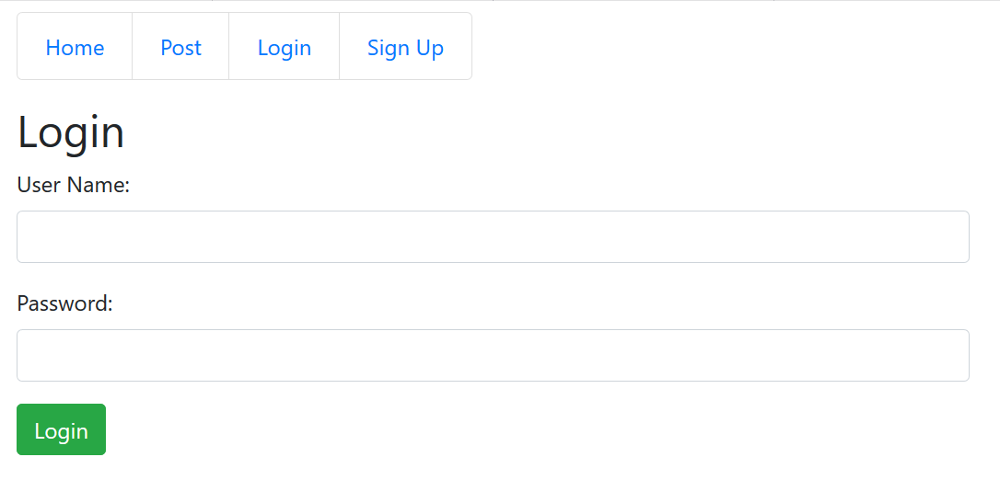
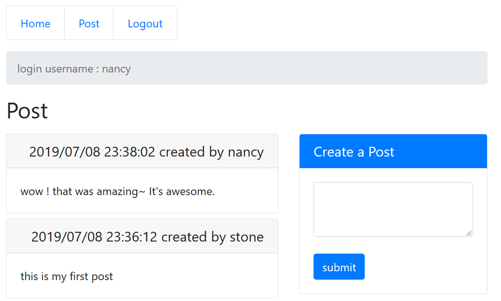

# Simulate Simple Reddit with RabbitMQ

To try to implement a simple website with a message queue like Reddit sharing contents by posting text.<br>
The architecture is designed by separating Front-End and Back-End service.<br>
The Back-End service has two parts. One service serves Front-End, and the other one<br>
is a comsumer of a message qeueu for creating post.<br>

Define structure : <br>
<b>reddit-frontend</b> represents UI presentation layer.<br>
<b>reddit-backend-master</b> is a gradle root project.<br>
<b>reddit-backend-commons</b> is a sharing library for all subprojects.<br>
<b>reddit-backend-web</b> represents a stateless Back-End service with RESTFul APIs.<br>
<b>reddit-backend-worker</b> is responsible for creating a post which received from reddit-backend-web by message queue.<br>


## Tech Stack
Front-End : ReactJS, Bootstrap, axios, npm<br>
Back-End : Springboot, JPA, JWT(JSON Web Tokens)<br>
DB : MongoDB<br>
Message Queue Broker : RabbitMQ<br>

## Test Enviroment
For local test, executing below docker command can lauch a MongoDB container.
``` bash
docker run --name my-mongo -p 27017:27017 -d mongo
```

To lauch a RabbitMQ container
``` bash
docker run -d --hostname my-rabbit --name my-rabbit -p 15672:15672 -p 5672:5672 rabbitmq:3-management
```

To start Back-End RESTful API
``` bash
cd reddit-backend-master
gradle reddit-backend-web:bootRun
```

To start Back-End Queue Worker
``` bash
cd reddit-backend-master
gradle reddit-backend-worker:bootRun
```

To start Front-End
``` bash
cd reddit-frontend
npm init
npm start
```
note : only execute <b>npm init</b> for the first time. 

Open [http://localhost:3000](http://localhost:3000) to view it in the browser.




